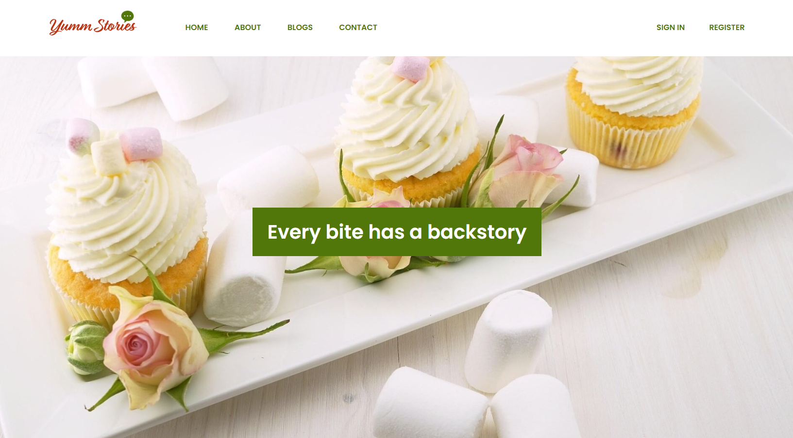
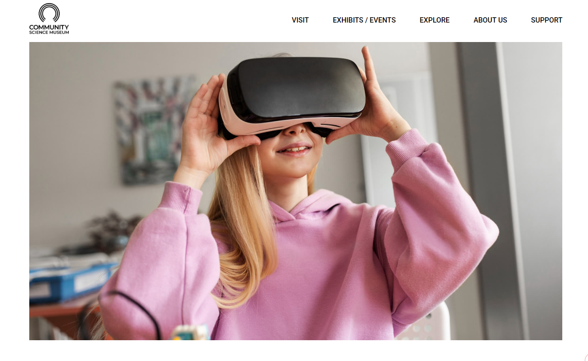
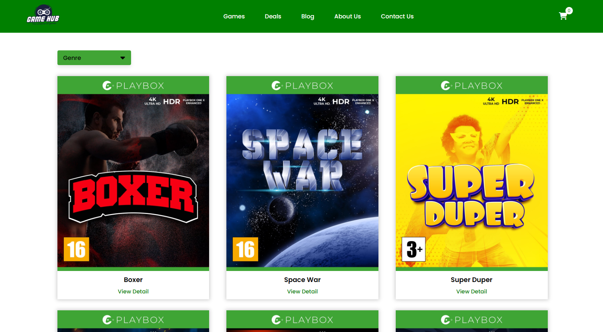
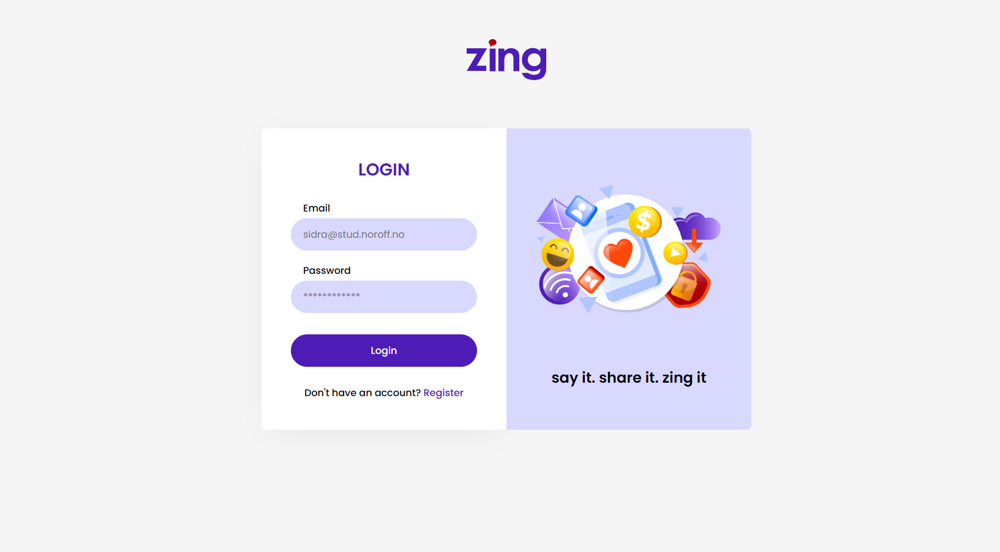
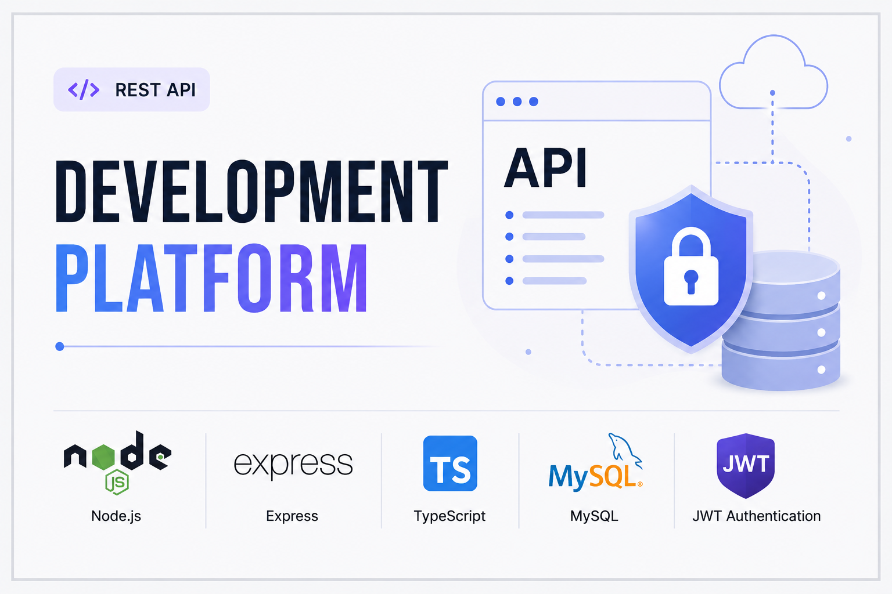

## 👩‍💻 About Me

I am a frontend development student passionate about creating clean, responsive, and user-friendly websites.

- 🌱 Currently learning HTML, CSS, JavaScript, and API integration
- 💻 Building projects as part of my frontend development course
- 🎯 Goal: Become a professional frontend developer
- ✨ Interested in responsive design, accessibility, and modern UI

## 🛠️ Tech Stack

## 🌟 Featured Projects

<table>
<tr>

<td width="50%">

### 🍽️ Yumm Stories

Yumm Stories is a responsive food blogging website where users can explore, create, and manage food stories.

**Tech:** HTML • CSS • JavaScript • API

🔗 [Live Demo](https://yummstories.netlify.app/) | 💻 [GitHub Repository](https://github.com/SidraShahid0510/FED1-PE1-SidraShahid0510-YT.git)

</td>

<td width="50%">

### 🏛️ Community Science Museum

A responsive website featuring exhibits, educational content, and user-friendly navigation across all devices.

**Tech:** HTML • CSS

🔗 [Live Demo](https://sidrashahid0510.github.io/Community-Science-Museum/) | 💻 [GitHub Repository](https://github.com/SidraShahid0510/Community-Science-Museum.git)

</td>

</tr>
<tr>

<td width="50%">

### 🎮 Game hub

     
This website was to create an interactive online store to display products from an API endpoint.

**Tech:** HTML • CSS • JavaScript • API

🔗 [Live Demo](https://sidrashahid0510.github.io/JavaScript-CA/) | 💻 [GitHub Repository](https://github.com/SidraShahid0510/Game-Hub.git)

</td>

<td width="50%">

### 👥 ZING Social Media App

Zing is a social media app featuring CRUD posts, comments, reactions, and follow/unfollow functionality.

**Tech:** HTML • CSS • Vanilla JS (ES modules)

🔗 [Live Demo](https://sidrashahid0510.github.io/ZING-SM-APP/index.html) | 💻 [GitHub Repository](https://github.com/SidraShahid0510/ZING-SM-APP.git)

</td>

</tr>

<tr>

<td width="50%">

### 💻 Development Platform

     
A REST API that allows users to register, log in, and submit news articles with secure JWT authentication.

**Tech:** Node.js • Express • TypeScript • MySQL

🔗 [Live Demo](https://sidrashahid0510.github.io/JavaScript-CA/) | 💻 [GitHub Repository](https://github.com/SidraShahid0510/Game-Hub.git)

</td>

<td width="50%">

### 👥 ZING Social Media App

Zing is a social media app featuring CRUD posts, comments, reactions, and follow/unfollow functionality.

**Tech:** HTML • CSS • Vanilla JS (ES modules)

🔗 [Live Demo](https://sidrashahid0510.github.io/ZING-SM-APP/index.html) | 💻 [GitHub Repository](https://github.com/SidraShahid0510/ZING-SM-APP.git)

</td>

</tr>
</table>

  

        

